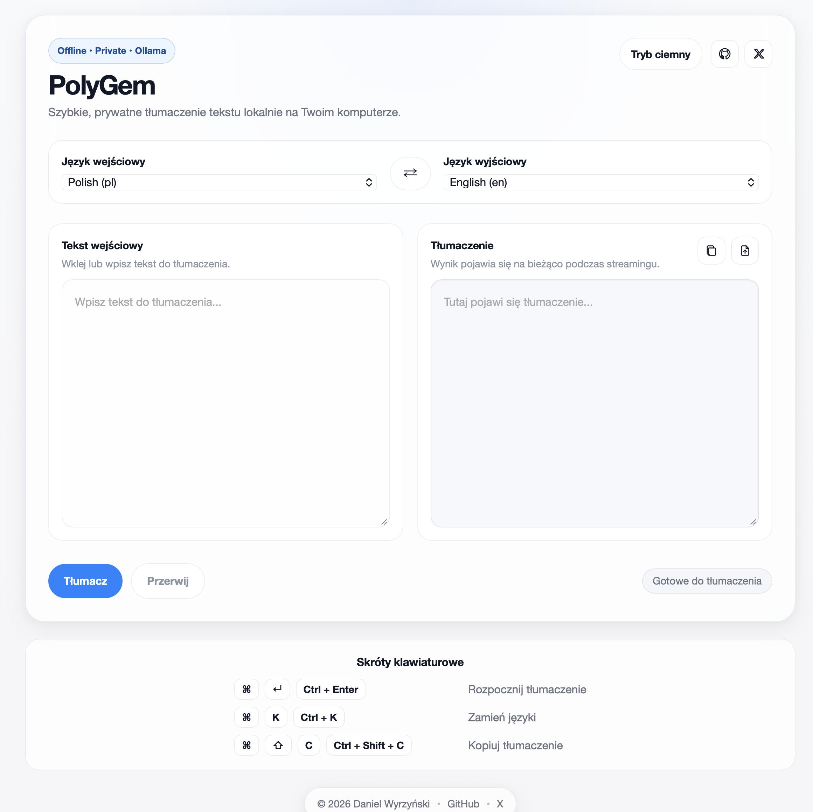

Lokalna, prywatna aplikacja webowa do szybkiego i strumieniowego tłumaczenia tekstu przy użyciu modelu Ollama (translategemma), działająca w 100% offline na localhost.

<p align="center">
  
</p>

## Wymagania
- Zainstalowane UV
- Zainstalowana i uruchomiona Ollama
- Pobrany model `translategemma`

## Instalacja UV
Install uv with our standalone installers:

```sh
# On macOS and Linux.
curl -LsSf https://astral.sh/uv/install.sh | sh
```

```powershell
# On Windows.
powershell -ExecutionPolicy ByPass -c "irm https://astral.sh/uv/install.ps1 | iex"
```

## Ollama i model
- Zainstaluj Ollama z `ollama.com`
- Pobierz model:
```sh
ollama pull translategemma
```

## Uruchamianie
```sh
uv run src/app.py
```

## Funkcjonalności
- Tryb jasny/ciemny zapamiętywany w LocalStorage
- Zapamiętywanie wybranych języków w LocalStorage
- Export tłumaczenia do pliku `.txt`

## Zmienne środowiskowe
- `OLLAMA_CUSTOM_ADDR` – opcjonalny adres serwera Ollama (domyślnie lokalny).
- `OLLAMA_VERYFI_SSL` – ustaw `false/0/no`, aby wyłączyć weryfikację certyfikatu TLS.

## Skróty klawiaturowe
- ⌘⏎ / Ctrl+Enter – rozpocznij tłumaczenie
- ⌘K / Ctrl+K – zamień języki
- ⌘⇧C / Ctrl+Shift+C – kopiuj tłumaczenie
